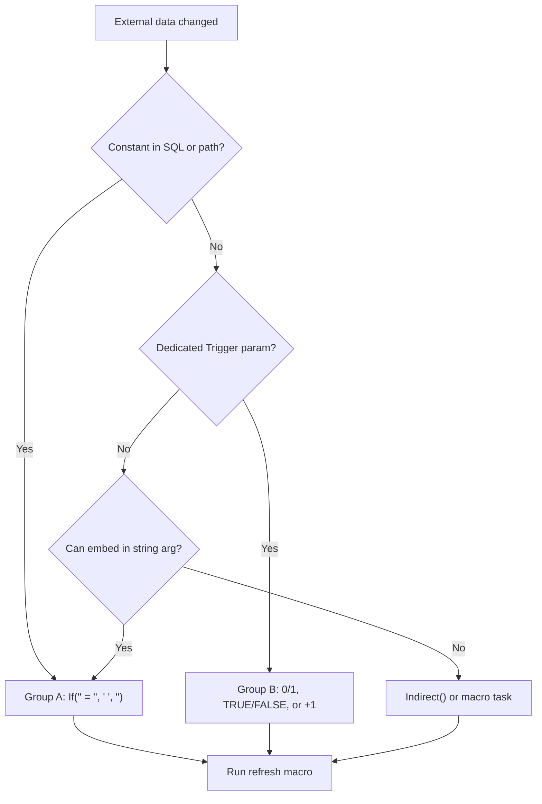

DriveWorks recalculates a **Rule** only when a value it depends on changes. Functions that read **external** data (database, Group security, PDM vault, filesystem, Autopilot logs) often have no automatic link to that source, so results can go stale during a running **Specification**. The fix is a **recalculation trigger**: a **Constant** (or control value) you change on purpose so the function runs again.

DriveWorks documents this as a **Recalculation Trigger** (Specification PowerPack), **Trigger** (Salesforce, SYSPRO), or **Refresh** (PDM). Internally the parameter type is `ITrigger`; in **Rule Builder** you pass any rule value—usually `DWConstantRefresh…` bumped by a **Drive Constant Value** task in a **Specification Macro**.

<Info>
Official KB: *How To: Force a data refresh when data has changed* (DriveWorks help). Database-specific: *Force views from a database to refresh when the data has changed*.
</Info>

## Quick choice

| Your situation                                    | Do this                                                                          |
| ------------------------------------------------- | -------------------------------------------------------------------------------- |
| Constant is **concatenated into SQL or a path**   | Text flip: `If(DWConstantRefresh = "", " ", "")`                                 |
| Constant is **only** a dedicated trigger argument | Numeric/boolean flip (`0`/`1`, `FALSE`/`TRUE`) or counter `+ 1`                  |
| Function has **no** refresh parameter             | Embed token in a string arg, wrap in `Indirect()`, or refresh via **macro task** |
| Long macro; form should update mid-run            | **Drive Constant Value** then **Update Form UI**                                 |

## Core pattern

1. Add a **Project Constant** (e.g. `RefreshLineItem` → `DWConstantRefreshLineItem`). Default is usually empty text or `0`.
2. Reference it in the **Rule** (as the last argument, or appended to SQL/path).
3. Create a **Specification Macro** (e.g. `RefreshLineItem`) with **Drive Constant Value** that changes the Constant.
4. Run that macro after external data changes (button, transition, child spec complete, SQL task, etc.).

Example macro rule (Autex standard for SQL-backed refresh):

```text
If(DWConstantRefreshLineItem = "", " ", "")
```

Example Rule using the token in SQL:

```text
QueryData(
  DWVariableCPQSQLServer,
  @"SELECT [PriceList] FROM [driveApp-CPQ-Orders-CustomFields]
    WHERE [OrderId] = '@(DWVariableOrderId)'" & DWConstantRefreshLineItem,
  DWVariableSQLUserName,
  DWVariableSQLPassword
)
```

## Ways to force a refresh

### Macro + Drive Constant Value

The usual pattern. Flip or increment a Constant so every dependent Rule recalculates.

### Embed the token in a string argument

When there is no `Recalculation Trigger` parameter, append the Constant to **SQL** or a **path** so DriveWorks sees an argument change:

```text
DbQuery(conn, @"SELECT … WHERE Id = '@(OrderId)'" & DWConstantRefresh, user, pass)
SppGetFolders(folderPath & " " & DWConstantRefresh, FALSE)
FsGetFiles(directoryPath & DWConstantRefresh, FALSE, "", 2)
```

`QueryData`, `QueryDataValues`, and `DbQuery` only re-evaluate when an argument changes (per DriveWorks docs).

### Dedicated trigger parameter

Pass the Constant as the optional last argument where the function defines one:

```text
SppGetAllTeams(DWConstantRefreshData)
SppGetModelQueueCount(DWConstantDrivenValue)
PDMFileSearch("MainAssembly.sldasm", folder, DWConstantRefreshNow)
```

Any change to the value is enough; type is loosely typed (`Variant`).

### Indirect()

Wrap the function call in a rule **string** so `Indirect` re-evaluates when references inside the string change:

```text
Indirect("DbQuery(" & connectionArg & ", " & sqlWithRefresh & ", …)")
```

Official workaround for `DbQuery` when form-driven refresh is required.

### Macro tasks (bypass live Rules)

Use when data should refresh on a button click, not on every form recalc:

| Task                                          | Use for                                                                |
| --------------------------------------------- | ---------------------------------------------------------------------- |
| **Read Text File** → **Drive Constant Value** | External file content (no `FsReadText` Rule function)                  |
| **Evaluate Rule Value**                       | Run `GetAutopilotLog(…)` (or similar) once; store result in a Constant |
| **Run SQL Command**                           | One-shot write/read; not a live Rule                                   |

### Control-driven trigger

Flip during a running **Specification** via a control (not only on load). Salesforce docs recommend a **CheckBox** `FALSE` → `TRUE` or passing a control return:

```text
SFGetAccounts(LoginReturn)
SFCurrentlyLoggedIn(LoginReturn)
```

### Update Form UI

In multi-step macros (HTTP, copy folder), alternate **Drive Constant Value** (status or refresh token) with **Update Form UI** so the form recalculates before the macro finishes. DriveWorks examples use status strings like `MacroStarted`, `SendHTTPComplete`.

### State enter and timers

- Run a refresh macro on **Specification Flow** state enter.
- **Start Specification Timer** for periodic refresh macros.

## Constant flip: two groups

The trigger only needs to **change**. Autex and DriveWorks use two conventions depending on *where* the Constant appears.

### Group A — empty string / space (`""` / `" "`)

**Macro:**

```text
If(DWConstantRefreshX = "", " ", "")
```

**Use when** the Constant is concatenated into **SQL** or a **path**. A trailing space does not change query semantics; a path suffix still resolves.

| Pattern                             | Example                                                               |
| ----------------------------------- | --------------------------------------------------------------------- |
| SQL append                          | `"SELECT …" & DWConstantRefreshLineItem`                              |
| Path append                         | `SppGetFolders(specFolder & " " & DWConstantRefreshQuoteInfo, FALSE)` |
| Folder listing after external write | Same as path append on `FsGetFiles` / `FsGetDirectories`              |

**Typical functions:** `DbQuery`, `QueryData`, `QueryDataValues`, `SppGetFolders`, `FsGetFiles`, `FsGetDirectories`, `FsGetUrl`, `FsFileExists` (path arg).

Autex **Constants** in this group: `RefreshLineItem`, `RefreshQuoteInfo`, `RefreshCountSpecifyItems`, `RefreshRevisionCounter`, `RefreshBespokeFlag` (Workflow, DocumentViewer, Groove, and related projects).

### Group B — `0`/`1`, `FALSE`/`TRUE`, or counter

**Macro (pick one):**

```text
If(DWConstantRefreshX = 0, 1, 0)
If(DWConstantRefreshX = FALSE, TRUE, FALSE)
DWConstantRefreshX + 1
Not(DWConstantRefreshX)
```

**Use when** the Constant is passed **only** as a `Recalculation Trigger` / `Trigger` / `Refresh` argument, or boolean gating is intentional.

| Pattern            | Example                                                                   |
| ------------------ | ------------------------------------------------------------------------- |
| Queue / monitoring | `SppGetModelQueueCount(DWConstantDrivenValue)`                            |
| Group cache        | `SppGetGroupTableCache("Colors", DWConstantRecalculate)`                  |
| PDM                | `PDMGetFolderTemplates(DWConstantRefreshFolderTemplates)`                 |
| Salesforce         | `SFGetAccounts(TRUE)` — docs use boolean flip on connect                  |
| Boolean UI         | `CSSToggle` macro: `Not(Indirect("DWConstant" & DWCurrentMacroArgument))` |

For dedicated trigger parameters, **either Group A or B works**; Autex prefers Group A when the same Constant also appears in SQL.

## Functions with an explicit refresh parameter

| Family                  | Parameter name                     | Examples                                                                                                                                                                                                                                        |
| ----------------------- | ---------------------------------- | ----------------------------------------------------------------------------------------------------------------------------------------------------------------------------------------------------------------------------------------------- |
| Specification PowerPack | Recalculation Trigger (or Trigger) | `SppGetAllTeams`, `SppGetAllUsers`, `SppGetGroupTableCache`, `SppGetGroupTables`, `SppGetMachineInfo`, `SppGetModelQueueCount`, `SppGetModelsInQueue`, `SppGetTeamsDataForUser`, `SppGetUserDataForTeams`, `SppIsModelQueueEmpty`, `SppNewGUID` |
| PDM Pro                 | Refresh                            | `PDMBasicSearch`, `PDMFileSearch`, `PDMGetFolderTemplates`, `PDMGetSerialNumberNames`                                                                                                                                                           |
| Salesforce              | Trigger                            | `SFCurrentlyLoggedIn`, `SFGetObjectList`, `SFConnectionStatus`; `SFGetAccounts` uses its connect argument as refresh                                                                                                                            |
| SYSPRO                  | Trigger                            | `SysproGetAllAccountDetail`, `SysproGetAllItemDetail`                                                                                                                                                                                           |

Zero-argument overloads (e.g. `SppGetAllTeams()`) only update when the **Project** is opened or a **Specification** is started/opened—use the overload with a trigger for in-spec refresh.

## Functions without a refresh parameter

These read external state but do not accept a trigger. Use Group A (string embed), `Indirect()`, macro tasks, or control gating.

### Database

| Function          | Refresh approach                                                              |
| ----------------- | ----------------------------------------------------------------------------- |
| `DbQuery`         | Append `& DWConstantRefresh` to SQL; or `Indirect()`; or macro-only execution |
| `QueryData`       | Append to SQL string (Group A)                                                |
| `QueryDataValues` | Append to SQL string (Group A)                                                |

### Filesystem

| Function                         | Notes                                                                                       |
| -------------------------------- | ------------------------------------------------------------------------------------------- |
| `FsGetFiles`, `FsGetDirectories` | Docs: will not auto-update; change an argument (path + token)                               |
| `FsGetUrl`                       | Same                                                                                        |
| `FsFileExists`                   | Path change or path + token; not for “wait until file exists” (use **Wait Time** correctly) |

### Group / Autopilot (Shared Group)

| Function                                                                                       | Notes                                                                                               |
| ---------------------------------------------------------------------------------------------- | --------------------------------------------------------------------------------------------------- |
| `GetAutopilotLog`                                                                              | No trigger; use **Evaluate Rule Value** in macro or `Indirect("GetAutopilotLog(""AP01"")" & token)` |
| `GetAutopilotStatus`                                                                           | Same                                                                                                |
| `SppGetAutopilotsInGroup`                                                                      | No arguments; macro re-evaluate or timer                                                            |
| `SppGetSpecificationDetail`, `SppGetSpecificationDocuments`, `SppGetSpecificationModelsByName` | Macro / `Indirect`; snapshot by name                                                                |

### Security and Specification Flow

| Function                         | Notes                                                                                                                      |
| -------------------------------- | -------------------------------------------------------------------------------------------------------------------------- |
| `SecGetUsersInTeam`              | Recalc when team name arg changes                                                                                          |
| `SppGetOperationsAndTransitions` | Docs: only after a control change triggers form recalc—e.g. `If(CheckBoxReturn, SppGetOperationsAndTransitions(TRUE), "")` |

### 3D Preview

| Function                  | Notes                                              |
| ------------------------- | -------------------------------------------------- |
| `PreviewGetDocumentScene` | Tied to preview control state; not a Constant flip |

### External file content

There is no built-in Rule function to read arbitrary file text. Use **Read Text File** in a **Specification Macro** and **Drive Constant Value** into a Variable or Constant.

## Decision flow



## Autex conventions

- One refresh **Constant** per domain (`RefreshLineItem`, `RefreshQuoteInfo`, …).
- One small **Specification Macro** per Constant that only flips the value.
- Chain refresh at the end of macros that change external data (`Confirm` → `RefreshLineItem` in Workflow).
- SQL-backed live Rules: Group A (`""` / `" "`) almost exclusively.
- `CSSToggle`: boolean Constants via `Not(Indirect("DWConstant" & DWCurrentMacroArgument))`.

## Related

- [Administrator](/driveworks/how-to/administrator) — macros, form maintenance
- [SQL](/driveworks/how-to/sql) — database tables and exports
- [Autopilot](/driveworks/how-to/autopilot) — agents and Shared Group context
- [Specification Host Input Values](/driveworks/how-to/specification-host-input-values) — child spec and host patterns
- [DriveWorks How To](/driveworks/how-to) — index
