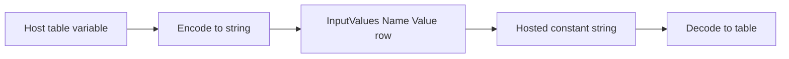

The **Specification Host** control passes data into a **hosted** specification through the **Input Values** property: a two-column table whose rows drive **Constants** or **Controls** in the hosted **Project**. Values stay synchronized while the hosted specification is open. Official product help: *Specification Host* → *Passing Data* and KB *Input Values*.

## Requirements

- **Input Values** must be a table with header columns **`Name`** and **`Value`** (case-insensitive).
- **`Name`** is the hosted **Constant** or **Control** name (the engine resolves `MyConstant` and `DWConstantMyConstant`).
- **`Value`** cells must be **scalars** (text, number, boolean). Do not place a nested table or array literal in **Value**.
- For many dynamic inputs, build the outer table from a host **Calculation Table** with one scalar per row (DriveWorks KB *Input Values* → *Dynamic Array*).

## Common problem: table becomes one word

**Symptom:** A **Value** cell contains a table such as `{"Name","Value";"foo","bar"}`, but the hosted **Constant** receives only `Name`.

**Cause:** The engine reads **Input Values** as strings only (`GetElementAsString` per row). When **Value** holds a table, Titan’s array-to-string conversion uses cell `(0,0)` only, then `SetNamedItemValues` assigns that string. The full table is never transferred.

<Warning>
Do not put a table object in a **Value** cell. Use scalar encoding below or flatten into multiple **Name** / **Value** rows.
</Warning>

## Workaround: encode and decode



**Preferred:** Flatten data — add one **Input Values** row per scalar field on the hosted side.

**When a table is required:** Encode on the host, store the result in a hosted **Constant** (string), decode with a **Rule** on the hosted **Project**.

<Tabs>
<Tab title="CSV (native)">
No **PowerPack** required.

| Step | Rule |
|------|------|
| Host **Value** | `CsvFromTable(DWVariableSourceTable)` |
| Hosted decode | `TableFromCsv(DWConstantHostedTablePayload)` |

**Caveat:** Commas or line breaks inside cell text can break CSV. Use JSON or Base64 for messy text.

**Functions:** `CsvFromTable`, `TableFromCsv` (native).

**Example Input Values row:**

```driveworks
\{"Name","Value";"HostedTablePayload",CsvFromTable(DWVariableSourceTable)\}
```
</Tab>
<Tab title="JSON (Specification PowerPack)">
**Specification PowerPack** must be enabled in host and hosted **Projects**.

| Step | Rule |
|------|------|
| Host **Value** | `SppConvertTableToJson(DWVariableSourceTable)` or `SppConvertTableToJson(DWVariableSourceTable,TRUE)` |
| Hosted decode | `SppConvertJsonToTable(DWConstantHostedTablePayload)` |

**Functions:** `SppConvertTableToJson`, `SppConvertJsonToTable`.

**Example Input Values row:**

```driveworks
\{"Name","Value";"HostedTablePayload",SppConvertTableToJson(DWVariableSourceTable)\}
```
</Tab>
<Tab title="Base64 (native encode, SPP decode)">
Use when CSV or JSON characters are awkward in **Constants** or rules. Base64-wrap an already-encoded CSV or JSON string.

| Step | Rule |
|------|------|
| Host **Value** | `Base64Encode(CsvFromTable(DWVariableSourceTable))` or `Base64Encode(SppConvertTableToJson(DWVariableSourceTable))` |
| Hosted decode (CSV inside) | `TableFromCsv(SppDecodeBase64String(DWConstantHostedTablePayload))` |
| Hosted decode (JSON inside) | `SppConvertJsonToTable(SppDecodeBase64String(DWConstantHostedTablePayload))` |

**Functions:** `Base64Encode` (native); `SppDecodeBase64String` (Specification PowerPack). There is no native Base64 decode function.

**Example Input Values row:**

```driveworks
\{"Name","Value";"HostedTablePayload",Base64Encode(CsvFromTable(DWVariableSourceTable))\}
```

Hosted **Variable** (or rule on a **Calc Table**) decodes with `TableFromCsv(SppDecodeBase64String(DWConstantHostedTablePayload))`.
</Tab>
</Tabs>
## Related

- [DriveWorks Troubleshooting](/driveworks/troubleshooting) — short symptom entry
- [Table-driven form control properties](/driveworks/how-to/table-driven-form-control-properties)
- DriveWorks help: *Specification Host*, *Input Values*, *Set Specification Host Control*
