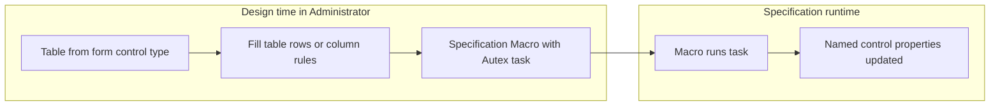

Use this flow when you need a **Specification Macro** to set **many properties on one User Form control** from tabular data, without chaining dozens of indirect Rules through Constants or lookup columns. **Autex Toolkit** scaffolds the table from control metadata; **AutexCustom** applies a chosen row at runtime.

## Why use this pattern

In **DriveWorks Administrator**, many control properties can be rule-driven in **Form Designer** ([static vs dynamic properties](https://docs.driveworkspro.com/Topic/HowToChangeAStaticPropertyToADynamicProperty)). At **Specification** runtime, driving the control’s **return / input value** and other properties from a macro is limited: native macro tasks target **task** properties, not the full form-control surface.

Common workarounds—**Constants**, **Simple Tables** or **Group Tables** referenced from many Rules, or table lookups on every property—work but scale poorly (rule noise, evaluation cost, maintenance).

**Autex** keeps configuration in one table and one macro task:

- [**Table from form control type**](/driveworks/plugins/toolkit/scripts-release-catalog) (Toolkit) creates columns that match real property names.
- [**Autex Drive Form Control From Table**](/driveworks/plugins/autexcustom#autex-drive-form-control-from-table) (AutexCustom) maps **non-empty** cells in a data row to the target control. Empty cells are **skipped** (they do not clear an existing value).

## When this fits

| Use this flow | Consider something else |
|---------------|-------------------------|
| One control, many properties updated together in a macro (transition, operation, hosted spec) | Bulk **default values** for many controls — see **Drive controls** in the [Release scripts catalog](/driveworks/plugins/toolkit/scripts-release-catalog) (different workflow) |
| Property set aligns with known control types (TextBox, ComboBox, …) | Duplicate controls — [Autex Copy Form Control](/driveworks/plugins/autexcustom#autex-copy-form-control) |
| Several types share property names (Caption, Value, …) | Change control type — [Autex Change Form Control Type](/driveworks/plugins/autexcustom#autex-change-form-control-type) |
| Same column set shared across Projects | **Group table** scaffold; macro still runs in **Project** specification context |

## Prerequisites

- **DriveWorks Administrator** with an open **Project** (and **Group** connected).
- **Autex Toolkit** and **AutexCustom** installed and loaded ([Autex plugins](/driveworks/plugins)).
- Target **User Form** control already exists; you know its **name**.
- For the Toolkit script **Create** step: a writable **Project** (not a read-only `.driveprojx` snapshot). **Group table** creation requires an open **Group**.

<Info>
Both plugins must be present at runtime. AutexCustom uses Toolkit metadata to resolve property names.
</Info>

## Overview



Typical order: scaffold table → fill values → add macro task → test in **Specification Test**.

## Step 1 — Scaffold the table (Autex Toolkit)

1. Open **Autex Tools** ([Autex Tools window](/driveworks/plugins/toolkit/autex-tools-window)).
2. Run **Table from form control type**.
3. **Configure** on the script card:
   - **Table name** — e.g. `FormControlProps`
   - **Table type** — **Simple table** is the best fit for this how-to (wide layout: header row + data rows). **Calc table** when every column must be a **Rule** in Project Designer. **Group table** for group-scoped data.
   - **Replace existing table** — on when rebuilding the same name
   - **Form control types** — tick one or more types (e.g. TextBox and NumericTextBox). Use **All**, **None**, or **Invert** on the checkbox list as needed
4. **Run** — review lists one **Property** row per merged column (duplicate property names across types appear once).
5. Tick the properties to include as columns, then **Create** (label matches table type).

**Column headers** are sanitized from property names (letters only, PascalCase; suffix `A`, `B`, … on collision). The macro accepts either these column names or the raw **Property** name.

<Info>
**Simple table** output: row 0 = column headers, row 1 = blank data row — the same shape the macro expects (header row + data rows).
</Info>

Script danger level: **preview then apply** ([Release scripts catalog](/driveworks/plugins/toolkit/scripts-release-catalog)). Nothing is written until you tick rows and choose **Create**.

## Step 2 — Fill the table

### Simple table (recommended)

1. Open the table under **Project Designer** → **Define Tables** → **Simple Tables**.
2. Row 0 is the header (created by the script). Edit **row 1** (and add rows for more scenarios).
3. Enter literals in cells. For properties that support rules, a leading **`=`** in the cell is treated as rule text when the macro runs.

**Multiple scenarios:** add data rows; set the macro **Data row index** to `1`, `2`, … (1-based index of the data row; row `0` is always headers).

### Calc table

Use when values must live as **Rules** on calc columns. The macro still needs a **table or array** with row `0` = headers and row `1+` = values. Options:

- Prefer a **Simple table** filled from evaluated rules, or
- Build a wide array in a **Rule** (header row + one data row) and bind that to **Properties table**

Test the bound rule in **Rule Builder** before relying on it in the macro.

### Group table

Same wide grid as a Simple table, stored at **Group** scope. Reference with `DWGroupTable…` in Rules. The macro runs in **Project** context; bind **Properties table** to a rule that resolves to the group table array shape above.

### Cell semantics (macro task)

| Property kind | Cell content |
|---------------|----------------|
| **ValueOrRule** | Leading `=` → rule; otherwise static value (coerced by type) |
| **Rule only** | Always rule text |
| **Value only** | Static value; must parse (bool, number, text) |

## Step 3 — Wire the Specification Macro (AutexCustom)

1. Open **Specification Macros** and create or edit the macro that should drive the control.
2. Add **Autex Drive Form Control From Table** ([task reference](/driveworks/plugins/autexcustom#autex-drive-form-control-from-table)).
3. Set task properties:

| Input | What to enter |
|-------|----------------|
| **Form control name** | Exact name of the control on the **User Form** |
| **Properties table** | Dynamic (rule-bound) **table** or **array** — not plain text. Must evaluate to a 2D table with **row 0 = column headers** |
| **Data row index** | **1-based** index of the data row (`1` = first row after headers). Default `1` matches the script’s first blank data row |

#### Simple table wiring (primary)

1. Toggle **Properties table** to **Dynamic** in the macro task ([change static property to dynamic](https://docs.driveworkspro.com/Topic/HowToChangeAStaticPropertyToADynamicProperty)).
2. Bind to the Simple table lookup, for example:

```text
DwLookupFormControlProps
```

Use your table name: DriveWorks exposes Simple tables as `DwLookup` + table name (PascalCase, no spaces).

3. Set **Data row index** to `1` for the first data row, or to a **Variable** / rule when the row varies per specification.

**Table shape check:** Row `0` must be headers (column names from the scaffold). Row `1` is the first data row the task reads when **Data row index** is `1`.

#### Calc table wiring

Bind **Properties table** to a rule that produces the same header + data row layout, or use a Simple table as the macro feed and keep calc columns as the authoring surface for complex rules.

4. Use the **Result** output for a short summary (applied count or error). **Diagnostic** is populated only in Debug builds of AutexCustom.

<Warning>
Columns that do not match a property on the **target control’s type** are skipped. A merged scaffold from several types may include extra columns; that is expected.
</Warning>

## Step 4 — Test

1. Run **Specification Test** (or trigger the macro from your **Specification Flow**).
2. Confirm the control’s properties updated as expected.
3. Read **Result** on the task if something did not apply.
4. Adjust table data or **Data row index** and re-test.

## Changing and maintaining the setup

| Change | Action |
|--------|--------|
| Add or remove columns | Re-run **Table from form control type** with **Replace existing table**; re-tick properties |
| Include more control types in the column set | Re-run with more types selected (merged plan grows) |
| Change values | Edit the table in Administrator |
| Drive a different control | Change **Form control name**; ensure columns exist on that control’s type |
| Pick another data row | Add Simple table rows; set **Data row index** or bind it to a rule |

## Limitations and pitfalls

- **One control per task** — drive multiple controls with multiple task instances or separate tables/rows.
- **Empty cells do not clear** properties — set an explicit value/rule or change the control in Form Designer.
- **Name** property — rule-driven renames may fail; avoid driving **Name** from the table unless you have tested it.
- **Merged types** — columns for properties not on the target control are ignored.
- **Performance** — one table + one macro is usually cheaper than many per-property lookups, but very wide tables still cost evaluation time; tick only properties you need.
- **Group table** — macro runs per **Project** specification; confirm group table rules resolve in that context.

## Related

- [DriveWorks How To](/driveworks/how-to)
- [AutexCustom](/driveworks/plugins/autexcustom)
- [Autex Toolkit scripts](/driveworks/plugins/toolkit/scripts)
- [Release scripts catalog](/driveworks/plugins/toolkit/scripts-release-catalog) — **Table from form control type**, **Drive controls**
- [Autex Tools window](/driveworks/plugins/toolkit/autex-tools-window)
- [Administrator](/driveworks/how-to/administrator) — general form and macro notes
