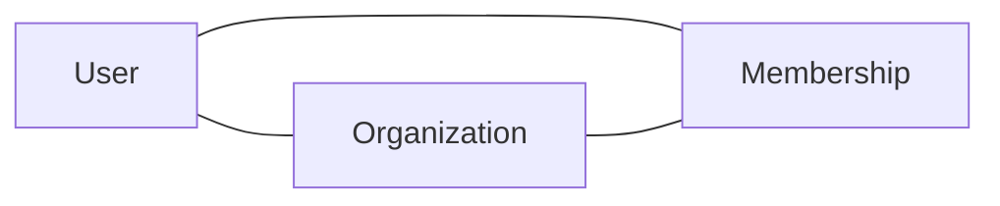

This page documents the primary domain entities that power Autex's platform, the relationships between them, and where each type of data lives in the storage layer. For authoritative schema definitions — including column types, constraints, and indexes — see the migration files in the Core API repository.

## Core entities

### User

A User represents an authenticated person in the system. One user can belong to multiple organizations, and their identity is scoped to their email address.

| Field | Type | Description |
|-------|------|-------------|
| `id` | UUID | Primary key |
| `email` | string | Unique — used for login |
| `created_at` | timestamp | Account creation time |
| `last_login_at` | timestamp | Last successful authentication |

### Organization

An Organization represents a company or team account. It is the primary boundary for both billing and access control — plans, seats, and permissions are all scoped to the organization.

| Field | Type | Description |
|-------|------|-------------|
| `id` | UUID | Primary key |
| `name` | string | Display name |
| `plan` | enum | `free`, `pro`, or `enterprise` |
| `owner_id` | FK → User | The billing owner of the organization |

### Membership

Membership is the junction table that links users to organizations. It holds the role for each user–organization pair and is the canonical source of truth for access control decisions.

| Field | Type | Description |
|-------|------|-------------|
| `user_id` | FK → User | The member |
| `org_id` | FK → Organization | The organization |
| `role` | enum | `owner`, `admin`, or `member` |
| `joined_at` | timestamp | When the membership was created |

## Relationships

A user can be a member of many organizations. An organization can have many members. The Membership table holds the role for each user–organization pair — to check what a user can do in a given organization, look up their Membership record.

<Note>
  A user's `owner_id` reference on the Organization entity records the billing owner. This is distinct from the `role` field on Membership — it's possible for the billing owner to have a different membership role (e.g., if ownership was transferred).
</Note>

## Data storage

Different types of data live in different storage systems depending on their access patterns and lifecycle requirements.

| Data type | Storage | Notes |
|-----------|---------|-------|
| Relational data | **Postgres** | Primary store — accessed via Core API |
| Sessions | **In-memory store** | Short-lived; expire automatically when the session ends |
| File uploads | **S3-compatible object store** | Stored by key; referenced by URL in Postgres |
| Search index | **Search service** | Synced from Postgres via Worker |

<Note>
  Services access the database through Core API — they don't connect to Postgres directly. If your service needs data owned by Core API, call the Core API, don't query the database.
</Note>

## Sensitive fields

Several fields contain personally identifiable information (PII) or credentials and must be handled with care at every layer of the stack.

Fields that are encrypted at rest and must **never appear in logs**:

- `User.password_hash`
- Payment method tokens (stored in the payment processor and referenced by ID only — the full token never enters our systems)
- Any PII field written to audit logs

<Warning>
  If you're adding a new field that contains PII or credentials, flag it explicitly in your pull request for a security review. Don't assume existing logging or audit infrastructure handles it safely — it needs to be reviewed and configured for each new sensitive field.
</Warning>
