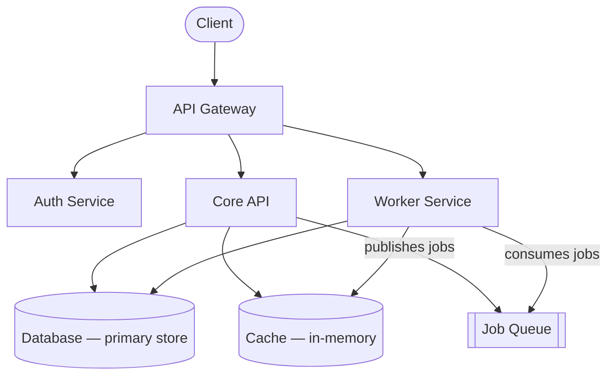

This page gives you a high-level map of our backend services and how they communicate. It's intentionally high-level — each service has its own README in its repository with deeper documentation on configuration, deployment, and local setup. Use this page to orient yourself and find the right repo.

## Service map

The diagram below shows how requests flow from the client through the system. The API Gateway is the single entry point for all external traffic; internal services communicate directly with each other and with shared infrastructure.

## Services

### API Gateway

The public-facing entry point for all client traffic. The API Gateway handles routing, rate limiting, and auth checks before forwarding requests to downstream services. It does not contain business logic.

- **Repo:** `api-gateway`

### Auth Service

Manages user identity, sessions, and permissions. The Auth Service integrates with our identity provider for SSO and is the authoritative source for access decisions across the platform.

- **Repo:** `auth-service`

### Core API

The main application backend. Core API handles business logic for the primary product domain and owns the primary database. If you're building a new product feature, you're almost certainly working here.

- **Repo:** `core-api`

### Worker Service

Processes background jobs asynchronously. Workers consume from the job queue and handle tasks that don't need to complete inline with a user request: email delivery, async data processing, scheduled tasks, and webhook delivery.

- **Repo:** `worker`

## Communication patterns

Our services communicate in three ways depending on the latency and reliability requirements of each interaction.

**Synchronous (HTTP)**
Services call each other over internal HTTP APIs. Requests are authenticated at every service boundary — no service trusts a request purely because it originated from inside the network.

**Asynchronous (Job Queue)**
Core API publishes jobs to the job queue; Worker consumes and processes them independently. This decouples work that doesn't need to happen in real time from the user-facing request path, improving both reliability and response latency.

**Events (Event Bus)**
Significant domain events — such as a user being created or a subscription changing — are published to the event bus. Downstream consumers subscribe to relevant events and react accordingly. This keeps services loosely coupled and avoids tight dependencies between Core API and every system that needs to know about domain changes.

## Environments

| Environment | Purpose | Access |
|-------------|---------|--------|
| **Local** | Development | All engineers |
| **Staging** | Pre-production verification | All engineers |
| **Production** | Live traffic | Deploy tool only |

<Warning>
  Never deploy directly to production by pushing code or running commands against the production environment manually. All production deployments must go through the deploy tool, which enforces required checks and approval gates.
</Warning>
