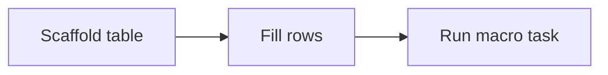

Mintlify pages are MDX: Markdown plus JSX components. Use plain Markdown when it is enough; add components when they improve scanability or structure.

See [Authoring conventions](/reference/authoring-conventions) for frontmatter, links, and DriveWorks terminology.

## Callouts

```mdx
<Info>Prerequisites or neutral context.</Info>

<Tip>Shortcut or best practice.</Tip>

<Note>Helpful detail that supports the main flow.</Note>

<Warning>Destructive action, data loss, or common failure mode.</Warning>

<Check>Verification that a step succeeded.</Check>
```

## Procedures

Use `<Steps>` with an `##` heading per step:

```mdx
<Steps>
## Open the Project

In **DriveWorks Administrator**, open the target **Project**.

## Run the script

Open **Autex Tools** and run the script from the catalog.

## Verify

Run **Specification Test** and confirm the control updates.

</Steps>
```

## Tabs

For alternative views (platform, table type, preview vs source):

```mdx
<Tabs>
  <Tab title="Simple table">Content for simple tables.</Tab>
  <Tab title="Calc table">Content for calc tables.</Tab>
</Tabs>
```

## Code blocks

Fenced blocks with an optional filename after the language tag:

````mdx
```powershell build.ps1
.\Build.ps1
```
````

SQL, JSON, and other languages use the same pattern.

### DriveWorks Rule examples

For **custom function** calls copied into **Rule Builder**, use a `driveworks` fence:

````mdx
```driveworks
AutexSlabPackingImage(DwLookupNested,1,DWLookupSlabPackingSettings,TRUE)
```
````

Or import the snippet component:

```mdx
import { DriveWorksRule } from "/snippets/DriveWorksRule.jsx";

<DriveWorksRule>
  AutexSlabPackingImage(DwLookupNested,1,DWLookupSlabPackingSettings,TRUE)
</DriveWorksRule>
```

Plugin reference pages can use `<CustomFunctionDoc>` from `/snippets/autex/CustomFunctionDoc.jsx` for structured UDF sections.

## Diagrams

Mermaid in a fenced block renders as a diagram:

````mdx

````

For interactive Administrator chrome maps, use diagram snippets under `/snippets/diagrams/` (see [Administrator UI region map](/driveworks/plugins/toolkit/injection/administrator-ui-map)).

## Images

Static assets from the Wiki migration live under `images/wiki/` in the repo; reference them by site path `/images/wiki/...`.

```mdx
<Frame>
  
</Frame>
```

For interactive chrome maps, prefer diagram snippets under `/snippets/diagrams/` and link the editable `.drawio` source (see [Administrator UI region map](/driveworks/plugins/toolkit/injection/administrator-ui-map)). PNG screenshots belong in the same `images/wiki/` tree when migrated from Wiki.js.

Always include descriptive alt text.

## Cards and hubs

Index pages often link to sections with cards:

```mdx
<CardGroup cols={2}>
  <Card title="How-to guides" icon="book-open" href="/driveworks/how-to">
    Task-oriented DriveWorks workflows.
  </Card>
  <Card title="Autex Toolkit" icon="wrench" href="/driveworks/plugins/toolkit">
    Plugin architecture, scripts, and injection guides.
  </Card>
</CardGroup>
```

Or import `SectionCardGrid` when passing a data array from the page.

## Accordions and optional detail

```mdx
<AccordionGroup>
  <Accordion title="Advanced options">
    Content readers can expand when needed.
  </Accordion>
</AccordionGroup>
```

Native HTML `<details>` also works for archived or low-priority sections.

## Lists and tables

Standard Markdown lists and tables need no wrapper component. Use tables for comparisons (when to use vs when to avoid).

## What not to use

This site is Mintlify, not Wiki.js. Do not use Wiki.js tabsets (`{.tabset}`), styled blockquotes (`{.is-info}`), or sibling `folder.md` index routing. Use Mintlify components and paths registered in `docs.json` instead.
